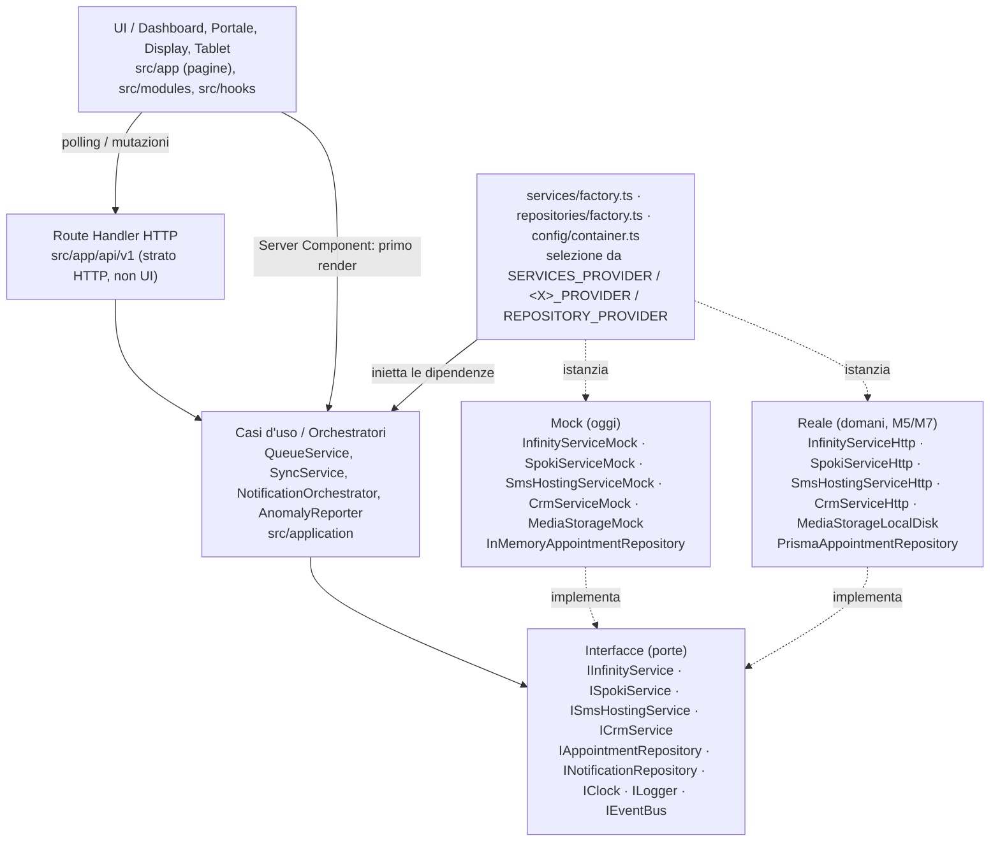
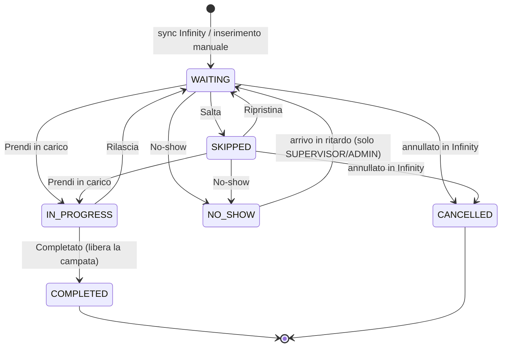

# ARCHITETTURA – Gestione Accettazione e Flussi Officina

> Documento di architettura consolidato. Fonti di verità: `CLAUDE.md` (regole di progetto e priorità) e `docs/ANALISI_REQUISITI.md` (moduli A–F). Ogni decisione che modifica questo documento richiede un ADR: fino a M0-T12 gli ADR esistono solo come tabella sintetica in §8; da M0-T12 diventano file in `docs/adr/` (un file per decisione).

## 1. Scopo e contesto

Il sistema sostituisce la gestione cartacea dell'accoglienza veicoli in officina presso Autoclub Group: acquisisce alle 06:00 l'agenda del giorno dal DMS Infinity, assegna a ogni pratica un codice progressivo (F001, F002…), mostra agli accettatori una coda ordinata per orario di prenotazione con le azioni Prendi in carico / Salta / Completato, espone al cliente (via QR code e targa) il proprio codice e il numero di clienti in attesa, invia promemoria WhatsApp tramite Spoki con fallback automatico su SMS Hosting, alimenta i 4 display delle campate e il fascicolo foto/video, e segnala al CRM/BDC i no-show e le anomalie di flusso (moduli A–F di `docs/ANALISI_REQUISITI.md`).

Il contesto tecnico è vincolante: oggi non esiste accesso a Infinity, Spoki, SMS Hosting né al CRM. `CLAUDE.md` impone quindi la **Regola d'Oro Mock-First**: ogni sistema esterno vive dietro un'interfaccia TypeScript ed è implementato, in questa fase, solo da classi Mock deterministiche. L'ordine di sviluppo è obbligatorio (P1 dashboard → P2 portale → P3 comunicazioni → P4 display → P5 tablet) e il modulo F è collocato come milestone M6, dopo P5, con i punti di innesto già presenti nello scaffold. Principio guida trasversale: **l'officina non deve mai bloccarsi**, quindi ogni chiamata esterna ha gestione degli errori e ogni funzione ha un fallback manuale in UI.

## 2. Stack tecnologico

| Area | Scelta | Versione | Motivazione |
| --- | --- | --- | --- |
| Runtime / package manager | Node.js LTS + **npm** | Node 24 LTS (minimo 22, `engines.node >=22`), npm ≥ 10 | Node 24 è la LTS attiva; `fetch`, `AbortSignal.timeout`, `crypto.randomUUID` nativi. npm è la scelta del PO: nessun campo `packageManager`, `package-lock.json` versionato, `npm ci` in CI; la guardia contro gli import fantasma è affidata a ESLint `no-restricted-imports` (M0-T08). Deploy come singolo processo Node long-running (Docker/VM/servizio Windows), **mai serverless** finché lo stato vive in memoria. Le versioni di questa tabella sono pinnate in `package.json` (verifica del 2026-09-10, annotata in `TASKS.md` M0-T06-S02: il JSON non ammette commenti). |
| Framework | Next.js App Router: Server Components per il primo render, Route Handlers `/api/v1` per letture in polling e mutazioni, `output: 'standalone'` | 16.3.4 pinnato (2026-09-10) | Baseline del PO. Una sola codebase per dashboard, portale, display, tablet e API. In Next 16 `middleware.ts` si chiama `src/proxy.ts`; `cookies()`/`headers()`/`params` sono async. Le mutazioni di dominio passano da Route Handlers, non da Server Actions. |
| Linguaggio | TypeScript strict (`strict`, `noUncheckedIndexedAccess`, `exactOptionalPropertyTypes`, `verbatimModuleSyntax`, `noUnusedLocals`, `noUnusedParameters`, `noImplicitReturns`, `noFallthroughCasesInSwitch`) | 5.9.3 pinnato. TypeScript 7 (compilatore nativo) è già sul registry ma **non viene adottato**: si passa quando plugin Next e typescript-eslint lo supportano (decisione da confermare con un ADR in M0-T12) | Regola CLAUDE.md. Branded ID, `Result<T,E>` e unioni discriminate rendono irrappresentabili gli stati illegali e fanno verificare dal compilatore lo swap Mock→Real. Verifica: `npm run typecheck` (`tsc --noEmit`). |
| UI | React 19 + Tailwind CSS 4 (config CSS-first) + shadcn/ui (Radix, componenti copiati in `src/components/ui`) + lucide-react | React 19.3.0, Tailwind CSS 4.3.3 (+ @tailwindcss/postcss 4.3.3, postcss 8.5.28) installati; shadcn CLI 3.x e lucide-react entrano con M0-T07 | Baseline del PO. Nessun lock-in (codice nel repo), primitive accessibili (Table, Dialog, Toast, Badge) per una dashboard monopagina densa e target touch da 48 px su tablet e kiosk. |
| Stato client / data-fetching | TanStack Query (polling: dashboard 3 s, display 2 s, portale 5 s; invalidazione dopo mutazione) + Zustand solo per preferenze UI | react-query 5.x, zustand 5.x | La coda è stato **server** (vincolo 7): il client tiene solo una cache con `dataUpdatedAt`. Gli hook `useQueue`/`usePublicStatus`/`useBayDisplay` nascondono il trasporto: l'upgrade SSE (M6) cambia solo l'interno dell'hook. |
| Validazione | Zod | 4.x | Un solo linguaggio di schema per env, DTO ai confini esterni (applicato anche ai mock), body delle Route Handler e asserzioni nei contract test. Entra in M0: lo scaffold puro usa type guard scritti a mano. |
| Auth | Sessione locale: JWT HS256 firmato con jose in cookie HttpOnly/SameSite=Lax (8 h); username+password su `IOperatorRepository` dietro `IAuthService`; guard in `src/proxy.ts`; display con `displayToken`; portale anonimo con rate limit | jose 6.x | Il login deve funzionare anche senza Internet/IdP. Auth.js v5 / Microsoft Entra ID diventano un'implementazione successiva della stessa `IAuthService`. Hash con scrypt nativo da M1 (nel seed dello scaffold le password sono in chiaro e segnalate). |
| Persistenza (fase mock) | Repository in-memory (`Map`) in un `InMemoryStore` singleton su `globalThis` dietro `I*Repository`; snapshot JSON atomico `.data/state.json` (tmp+rename) da M1; target Prisma 6 + PostgreSQL/SQLite | nessuna dipendenza nello scaffold | Vincolo 7: stato condiviso fra tutti i client. Lo stato grezzo vive su `globalThis` e sopravvive all'HMR di Next; le suite di contratto garantiscono che l'implementazione Prisma sia sostituibile senza modifiche ai chiamanti. |
| Realtime | Polling-first con TanStack Query; `IEventBus` (implementazione `InProcessEventBus`, log append-only con `listSince`) emette `DomainEvent` con `seq`; SSE `/api/v1/events` come acceleratore in M6 (resume via `Last-Event-ID`) | EventSource nativo | Carico minimo (pochi operatori, 4 display, qualche smartphone). Il polling funziona ovunque; SSE riduce la latenza senza server custom. WebSocket scartato. |
| Testing | Vitest + @testing-library/react (unit, componenti, contract suite) + Playwright (e2e, entra in M1-T17 con lo smoke test del modulo A) | vitest 4.x, testing-library 16.x, playwright 1.x (versione esatta pinnata in M1-T17) | Suite di contratto `tests/contracts/<porta>.contract.ts` eseguite oggi sui mock e domani sulle implementazioni reali/Prisma: garanzia comportamentale dello swap, non solo tipologica. |
| Lint / format / guardia architetturale | ESLint 9 flat (eslint-config-next, typescript-eslint) con `no-restricted-imports`; Prettier 3 + prettier-plugin-tailwindcss; `.gitattributes` (`* text=auto eol=lf`, già attivo) + `.editorconfig` (UTF-8, LF, 2 spazi); dependency-cruiser opzionale in CI | eslint 9.x, prettier 3.x | Rende meccanica la Regola d'Oro: `app/`, `modules/`, `components/`, `hooks/`, `application/` non possono importare `services/mocks`, `services/real`, `repositories/in-memory`, `repositories/prisma`. |
| Date / ID / logging | `Intl` con fuso `APP_TIMEZONE` (default Europe/Rome, `lib/dates.ts`) e `IClock` iniettato (`SystemClock` a runtime, `FixedClock` nei test); `IIdGenerator` (`UuidIdGenerator`, `SequentialIdGenerator` nei test); `ILogger` con `ConsoleLogger` (prefissi `[MOCK][Spoki]`) e `NoopLogger` nei test → log strutturato per richiesta con `correlationId` da M1 (`lib/http/with-logging.ts`), formato JSON (`JsonConsoleLogger` o pino) in M6 | date-fns 4 + @date-fns/tz solo se necessario da M1 | Sync 06:00, reset giornaliero dei codici e regole no-show sono sensibili al fuso e all'ora legale e devono essere deterministici nei test. Il fuso NON è letto da `TZ` (spesso UTC nei container) ma da `APP_TIMEZONE`, validato come zona IANA. |

## 3. Regola d'Oro: architettura Mock-First disaccoppiata

L'architettura è a **porte e adapter**. Il dominio e i casi d'uso conoscono solo interfacce; le implementazioni concrete (oggi Mock, domani Reali) sono scelte in un unico punto, il composition root, in base alle variabili d'ambiente. Nessun componente della UI importa mai una classe concreta.



### 3.1 Le porte verso l'esterno

- **`IInfinityService`** (DMS Infinity): `fetchDailyAgenda(businessDate)`, `fetchAppointmentByPlate(plate, businessDate)`, `healthCheck()`. Restituisce DTO "wire" (`InfinityAgendaDto`), mai tipi di dominio: il mapping vive in `services/mappers/infinity.mapper.ts`, condiviso da mock e adapter reale, così gli errori di mapping emergono subito. `InfinityServiceMock` genera 28–40 appuntamenti per giornata con `SeededRandom(seedFrom(MOCK_SEED, businessDate))`: l'agenda è **deterministica dato (seed, businessDate, numero di chiamata)**. La prima chiamata di una giornata restituisce sempre la stessa agenda (requisito per l'idempotenza della sync e per i test); con `MOCK_INFINITY_CANCEL_ON_SECOND_CALL=true` (default) dalla seconda chiamata dello stesso giorno ~5 % degli appuntamenti risulta `cancelled` (esercita la reconciliation) e la terza è identica alla seconda; con `false` tutte le chiamate sono identiche. Il contatore di chiamate vive in memoria e si azzera al riavvio: dopo un ripristino da snapshot la prima chiamata torna a essere "la prima", ma la sync non regredisce mai una `CANCELLED`. Slot di 15 minuti dalle 07:30 alle 12:00, ~10 % senza telefono, ~15 % senza opt-in WhatsApp, ~5 % con cifre finali forzate per esercitare i fallback; modalità `ok | error | timeout | flaky | partial | empty`.
- **`ISpokiService`** (WhatsApp): `sendTemplateMessage`, `getDeliveryStatus`, `parseWebhook`, `healthCheck`. `SpokiServiceMock` decide l'esito dall'ultima cifra del telefono, è idempotente per `idempotencyKey`, restituisce subito `UNDELIVERABLE` per la cifra 7 (così il fallback SMS si vede anche in demo con `SystemClock`) e passa a `DELIVERED` dopo `MOCK_DELIVERY_DELAY_MS` negli altri casi.
- **`ISmsHostingService`** (SMS di fallback): `sendSms`, `getDeliveryStatus`, `getCredits`, `healthCheck`. `SmsHostingServiceMock` simula il credito (`MOCK_SMS_CREDITS`, decrementato per segmento), calcola codifica (GSM-7 o UCS-2) e numero di segmenti del testo come farebbe il gateway (warning oltre il singolo segmento, nessun troncamento) e fallisce sul suffisso `99`.
- **`ICrmService`** (CRM/BDC, modulo F): `notifyNoShow`, `notifyAnomaly`, `notifyCheckIn`, `healthCheck`. `CrmServiceMock` logga il payload JSON con prefisso `[MOCK][Crm]`, è idempotente per `idempotencyKey` (stesso ack, nessun doppione) e conserva `received` per i test. Gli eventi passano sempre da `CrmNotifier` (`application/crm`), mai direttamente dai casi d'uso.
- **`IAppointmentRepository`** e gli altri `I*Repository`: persistenza interna, oggi `InMemory*` su `InMemoryStore`, domani Prisma.
- Porte trasversali iniettate ovunque e relative implementazioni: `IClock` → `SystemClock` (runtime) / `FixedClock` (test e demo); `IIdGenerator` → `UuidIdGenerator` / `SequentialIdGenerator` (test); `ILogger` → `ConsoleLogger` / `NoopLogger` (test); `IEventBus` → `InProcessEventBus`; `IMediaStorage` → `MediaStorageMock` (memoria, oggi) / `MediaStorageLocalDisk` (M5). Fuori dalle implementazioni non esistono `Date.now()`, `Math.random()` o `crypto` diretti. I tipi condivisi fra `config/env.ts` e i mock (`ProviderKind`, `RepositoryProvider`, `InfinityMockMode`, `CrmMockMode`, `MOCK_PHONE_RULES`) vivono in `services/interfaces/provider-kinds.ts` e `services/interfaces/mock-config.ts`, così la configurazione non importa mai una classe mock.

Ogni metodo esterno accetta `CallOptions { signal?, timeoutMs?, correlationId? }` e restituisce `ProviderResult<T> = Result<T, ProviderError>` con flag `retryable`: i mock **non lanciano mai eccezioni**, rispettano `signal` e latenza simulata e loggano con prefisso `[MOCK][Infinity]`, `[MOCK][Spoki]`, `[MOCK][SmsHosting]`, `[MOCK][Crm]`.

### 3.2 Interfaccia + factory: esempio

```ts
// src/services/interfaces/IInfinityService.ts
export interface IInfinityService {
  readonly name: 'INFINITY';
  fetchDailyAgenda(businessDate: IsoDate, options?: CallOptions): Promise<ProviderResult<InfinityAgendaDto>>;
  fetchAppointmentByPlate(plate: string, businessDate: IsoDate, options?: CallOptions): Promise<ProviderResult<InfinityAppointmentDto | null>>;
  healthCheck(options?: CallOptions): Promise<HealthStatus>;
}

// src/services/factory.ts – UNICO importatore di mocks/ e real/
export function createExternalServices(env: AppEnv, deps: ExternalServiceDeps): ExternalServices {
  const infinityKind = env.infinityProvider ?? env.servicesProvider; // 'mock' | 'real'
  const infinity: IInfinityService =
    infinityKind === 'mock'
      ? new InfinityServiceMock({ seed: env.mockSeed, mode: env.mockInfinityMode, /* … */ }, deps)
      : (() => { throw new NotImplementedError('Adapter reale Infinity non ancora disponibile (M7)'); })();
  // stesso schema per spoki, smsHosting, crm, mediaStorage
  return { infinity, spoki, smsHosting, crm, mediaStorage };
}

// src/config/container.ts – UNICO composition root: qui le porte vengono collegate ai casi d'uso
export function createContainer(overrides = {}): Container {
  const env = { ...parseEnv(), ...overrides.env };
  const store = overrides.store ?? InMemoryStore.getGlobal();           // stato condiviso su globalThis
  const repos = createRepositories(env, { clock, store });               // memory | prisma
  const external = createExternalServices(env, { clock, ids, logger, brands: [...store.state.brands], desks: [...store.state.desks] });
  const notificationOrchestrator = new NotificationOrchestrator({ spoki: external.spoki, smsHosting: external.smsHosting, notifications: repos.notifications, clock, ids, logger, eventBus });
  // M1+: const queueService = new QueueService({ ...repos, eventBus, clock, ids, logger, codeGenerator, env });
  return { env, clock, ids, logger, eventBus, external, repos, notificationOrchestrator };
}

// src/application/sync/SyncService.ts – dipende SOLO dall'interfaccia
const result = await this.infinity.fetchDailyAgenda(businessDate, { correlationId, timeoutMs: 5000 });
if (!result.ok) { /* SyncRun FAILED + banner, mai throw */ }
```

### 3.3 Fallback WhatsApp → SMS → contatto manuale

`NotificationOrchestrator` (in `src/application/notifications`, presente già nello scaffold) dipende solo da `ISpokiService`, `ISmsHostingService`, `INotificationRepository`, `IClock`, `IIdGenerator`, `ILogger`, `IEventBus`. Il `NotificationJob` persiste `code` (F001), `templateVariables` e `whatsappOptIn`, così i template Spoki ricevono il codice progressivo (mai l'id tecnico) e i retry sanno se tentare WhatsApp. Algoritmo di `sendReminder` **nello scaffold**: (1) idempotenza per `idempotencyKey = appointmentId:kind:businessDate` (job già oltre PENDING/FAILED → `ALREADY_PROCESSED`; un job `IN_FLIGHT` più vecchio di 5 minuti è considerato orfano di un crash e viene ripreso); (2) telefono assente → `NO_RECIPIENT`; (3) se `whatsappOptIn` tenta Spoki e registra un `NotificationAttempt`; (4) su errore o `UNDELIVERABLE` tenta SMS Hosting (secondo attempt), immediatamente; (5) se anche l'SMS fallisce: errore **non retryable** → `MANUAL_REQUIRED` e in UI compare "Conferma contatto manuale" (`confirmManual`); errore **retryable** (timeout, rete, rate limit) → `FAILED`, anch'esso confermabile a mano; (6) pubblica `NOTIFICATION_JOB_CHANGED`. Regola deterministica dei mock sull'ultima cifra del telefono (`MOCK_PHONE_RULES`): **0–6** consegnato, **7** WhatsApp `UNDELIVERABLE` immediato → SMS, **8** timeout retryable su entrambi i canali → `FAILED`, **9** richiesta non valida → SMS immediato, **99** falliscono entrambi i canali in modo non retryable → `MANUAL_REQUIRED`. Quindi 8 e 99 finiscono entrambi in "Da contattare a mano", ma solo 8 viene ritentato automaticamente.

**Evoluzione in M3** (M3-T03): gli errori `retryable` non passano subito al canale successivo ma producono `FAILED` con `nextAttemptAt` a backoff esponenziale (30 s, 2 min, 10 min; massimo 3 tentativi WhatsApp e 2 SMS) svuotato dallo scheduler; `refreshDeliveryStatuses` interroga `getDeliveryStatus` per i job `SENT`; `SUPPRESSED` è impostato per le pratiche annullate prima dell'invio; su `MANUAL_REQUIRED` viene scritto un `CrmOutboxEvent NOTIFICATION_FAILED`. Il comportamento dello scaffold (fallback immediato) resta quello dei test unitari di M0-T09.

### 3.4 Come si sostituisce un mock senza toccare le dashboard

1. Si scrive `src/services/real/InfinityServiceHttp.ts` che implementa la stessa `IInfinityService` usando `withTimeout`/retry di `services/resilience`.
2. Si esegue `tests/contracts/infinityService.contract.ts` con `CONTRACT_TARGET=real` su sandbox: la suite che oggi gira sul mock deve passare identica.
3. Nel factory si sostituisce il `throw NotImplementedError` del ramo `real` con l'istanza dell'adapter e si imposta `INFINITY_PROVIDER=real` in staging.
4. Il mock resta per sviluppo locale ed e2e. Nessun file in `app/`, `modules/`, `hooks/`, `application/` cambia: la regola ESLint `no-restricted-imports` lo garantisce meccanicamente.

## 4. Struttura delle cartelle

```text
webapp-accettazione-versione2/
├── CLAUDE.md                          # regole di progetto (esistente)
├── TASKS.md                           # piano milestone M0..M7 e stato dei task (M0-T03)
├── README.md                          # avvio rapido, architettura Mock-First, account demo, dashboard, script, struttura   [M0-T12 fatto]
├── ARCHITECTURE.md                    # architettura consolidata in italiano (questo documento)
├── .gitignore                         # Node/Next: node_modules, .next, next-env.d.ts, .env*, .data/, coverage   [BOOTSTRAP]
├── .gitattributes                     # `* text=auto eol=lf` + regole binary: LF forzato nel repo e nella working copy   [BOOTSTRAP]
├── .editorconfig                      # UTF-8 senza BOM, LF, 2 spazi, newline finale   [M0-T07 fatto]
├── .env.example                       # tutte le variabili di config/env.ts e config/auth.ts (SESSION_SECRET), default = tutto mock   [M0-T07 fatto]
├── tsconfig.json                      # Next (plugin next, react-jsx, incremental), strict, noUncheckedIndexedAccess, noUnused*, alias "@/*"   [BOOTSTRAP]
├── package.json / package-lock.json   # npm (scelta PO): script dev/build/start/typecheck; lint/format (M0-T08), test (M0-T09)   [BOOTSTRAP]
├── next.config.ts                     # reactStrictMode, output: 'standalone'   [BOOTSTRAP]
├── postcss.config.mjs                 # Tailwind 4 CSS-first (@tailwindcss/postcss)   [BOOTSTRAP]
├── eslint.config.mjs                  # flat config Next + typescript-eslint (type-aware); no-restricted-imports: mock/real/in-memory/prisma e factory/container fuori dal composition root   [M0-T08 fatto]
├── prettier.config.mjs                # Prettier 3, printWidth 100, singleQuote, endOfLine lf, plugin Tailwind   [M0-T07 fatto]
├── vitest.config.ts                   # Vitest 5: tests/**/*.test.ts, ambiente node, alias @/, coverage v8   [M0-T09 fatto]
├── playwright.config.ts               # (M1-T17) e2e: smoke login → prendi in carico → completato
├── components.json                    # (rinviato) CLI shadcn/ui: oggi primitive scritte a mano in components/ui con la stessa convenzione
├── docs/
│   ├── ANALISI_REQUISITI.md           # requisiti (esistente)
│   ├── GLOSSARIO.md                   # glossario IT→EN (M0, generato da src/domain/glossary.ts)
│   ├── RUNBOOK_OPERATIVO.md           # cosa fa l'officina quando Infinity/Spoki/SMS/CRM sono giù (M6)
│   └── adr/                           # ADR numerati, uno per decisione (M0)
├── public/
│   ├── brand/                         # loghi marchi (M1)
│   └── qr/                            # QR code stampabili per le corsie (M2)
├── tests/                             # test Vitest fuori da src, inclusi in tsconfig   [M0-T09 fatto]
│   ├── unit/                          # [fatti] state machine, codici, value object, PRNG, repository in-memory, InfinityServiceMock, CodeGenerator, QueueService, SyncService, LocalAuthService, hash password, segreto sessione
│   ├── helpers/                       # fixtures.ts: TestClock (IClock fisso e avanzabile), buildTestEnv(), makeAppointment()
│   ├── contracts/                     # runXContract(label, factory) eseguite su mock oggi, reali/Prisma domani
│   ├── fixtures/                      # agende Infinity congelate (JSON) per asserzioni deterministiche
│   ├── components/                    # Testing Library
│   └── e2e/                           # Playwright: login → prendi in carico → completato; portale targa
└── src/
    ├── README.md                      # nota breve in italiano su layering e Regola d'Oro   [SCAFFOLD]
    ├── proxy.ts                       # [M1/M5 fatto] guard JWT (firma e scadenza) su /accettazione, /tablet, /sistema, /manager, /admin, /api/v1 (esclusi auth/, health, public/, webhooks/); redirect /login?next=; x-correlation-id. Rate limit e SYNC_SECRET rinviati
    ├── instrumentation.ts             # [BOOTSTRAP + M1] register() su runtime nodejs: getContainer() (fail-fast) e avvio di SyncScheduler (06:00 con catch-up), un solo timer per processo
    ├── app/                           # SOLO routing e composizione pagine, nessuna logica: layout, error, page (redirect), providers, _server/,
    │   │                              # (auth)/login, (operator)/{accettazione,sistema} e api/v1 (auth, queue, appointments/[id]/actions, sync, health); il resto arriva con le milestone indicate
    │   ├── layout.tsx                 # root layout (lang it, globals.css) che monta providers.tsx   [fatto]
    │   ├── providers.tsx              # [M1 fatto] QueryClientProvider (client component)
    │   ├── _server/session.ts         # [M1 fatto] cartella privata: readSession/requireSession/readApiSession, cookie di sessione, correlationIdFrom
    │   ├── error.tsx                  # [BOOTSTRAP] error boundary radice in italiano (digest + "Riprova"); gli ErrorBoundary per modulo arrivano con le milestone
    │   ├── globals.css                # @import 'tailwindcss'   [BOOTSTRAP]; token colori stati in M0-T07
    │   ├── page.tsx                   # [M1 fatto] redirect: sessione valida → /accettazione, altrimenti → /login (la verifica delle porte è in /sistema)
    │   ├── (auth)/login/page.tsx      # [M1 fatto] login operatore: credenziali, Sportello/Brand (chip marchi), Postazione; account demo cliccabili
    │   ├── (operator)/                # area autenticata: accettazione, manager e admin (segnaposto con permessi), sistema
    │   │   ├── layout.tsx             # [M1 fatto] requireSession() + AppShell/Header (operatore, ruolo, postazione, sportello, orologio, logout)
    │   │   ├── accettazione/page.tsx  # [M1 fatto] dashboard coda: sportello / vista globale (URL), azioni rapide, banner sync, polling 3 s, dialog conflitto e campata occupata
    │   │   ├── accettazione/nuova/page.tsx        # P1 fallback: inserimento pratica manuale
    │   │   ├── accettazione/pratiche/[id]/page.tsx # dettaglio pratica, storico, notifiche, media
    │   │   ├── comunicazioni/page.tsx # P3 stato invii, reinvio, conferma contatto manuale
    │   │   ├── tablet/page.tsx        # [M5 fatto] accettazione al veicolo: solo le pratiche del proprio sportello, due schede grandi, check-in a tutto schermo
    │   │   └── sistema/page.tsx       # [M1 parziale] stato delle porte esterne (healthCheck); SyncRun, modalità mock, outbox CRM in M1-T15 / M6
    │   ├── (public)/cliente/page.tsx  # [M2 fatto] portale QR: ricerca targa mobile-first (formattazione live, validazione, nota privacy)
    │   ├── (public)/layout.tsx        # [M2 fatto] intestazione neutra, nessuna navigazione operatore, piè di pagina con rimando allo sportello
    │   ├── (public)/error.tsx         # [M2 fatto] error boundary del portale: messaggio comprensibile e pulsante Riprova
    │   ├── qr/page.tsx                # [M2 fatto] alias breve stampato sui cartelli: /qr?src=corsiaN → /cliente
    │   ├── (public)/cliente/stato/page.tsx        # [M2 fatto] esito: codice grande, clienti prima di te, messaggio per stato; polling 5 s lato client
    │   ├── (display)/display/[campata]/page.tsx   # [M4 fatto] monitor di campata a tutto schermo: /display/1 … /display/4 (anche C1), ?token= opzionale
    │   ├── (display)/display/sala-attesa/page.tsx  # [M4 fatto] tabellone della sala d'attesa: chiamati ora + prossimi turni
    │   └── api/v1/                    # Route Handlers: unica superficie HTTP per letture in polling e mutazioni
    │       ├── auth/login/route.ts, auth/logout/route.ts      # [M1 fatto] login (Zod, cookie HttpOnly SameSite=Lax, Secure in produzione, 8 h) e logout; rate limit rinviato (M1-T07-S04b)
    │       ├── auth/me/route.ts, auth/workstation/route.ts    # me [M1 fatto]; cambio postazione senza logout rinviato (M1-T11-S02)
    │       ├── auth/workstations/route.ts            # (non necessario) le postazioni arrivano al form di login come props del Server Component
    │       ├── queue/route.ts                        # [M1 fatto] GET coda (date, deskId, view=desk|global) + occupazione campate, ultima SyncRun, sportelli/marchi/postazioni
    │       ├── appointments/route.ts                 # (M1) POST inserimento manuale
    │       ├── appointments/[id]/route.ts            # (M1) GET dettaglio pratica
    │       ├── appointments/[id]/notes/route.ts      # (M1) PATCH note
    │       ├── appointments/[id]/actions/route.ts    # [M1 fatto] POST take|skip|complete|release|restore (expectedVersion, bayId?) → 409 con details.current; no-show/reopen e Idempotency-Key rinviati
    │       ├── public/status/route.ts                # [M2 fatto] GET ?targa= (alias ?plate=) → QueuePositionView, nessun dato personale, no-store, 404/400/429/503
    │       ├── public/display/route.ts               # [M4 fatto] GET ?campata=1|C1 → BayDisplayView (stato, codice, targa); token verificato se fornito
    │       ├── public/board/route.ts                 # [M4 fatto] GET ?prossimi=N → WaitingBoardView (solo codici: nessuna targa)
    │       ├── sync/route.ts                         # [M1 fatto] POST sync manuale (SUPERVISOR/ADMIN sempre, ADVISOR solo con sync assente o FAILED); GET ultime SyncRun e SYNC_SECRET rinviati
    │       ├── system/mock-settings/route.ts         # (M3) PATCH modalità mock a runtime (ADMIN, solo non-production)
    │       ├── system/bays/route.ts                  # (M4) GET stato di tutti i display (ADMIN: sotto system/, non public/)
    │       ├── notifications/route.ts, notifications/[id]/route.ts   # (M3) elenco job e tentativi, dettaglio
    │       ├── notifications/[id]/manual-confirm/route.ts, notifications/[id]/retry/route.ts, notifications/send/route.ts   # (M3)
    │       ├── crm/outbox/route.ts                   # (M6) GET coda eventi CRM
    │       ├── crm/outbox/[id]/retry/route.ts, crm/outbox/[id]/manual/route.ts   # (M6) retry manuale, segna inviato al BDC
    │       ├── appointments/[id]/media/route.ts      # [M5 fatto] POST foto (multipart, campo `foto`) e GET elenco foto della pratica; DELETE in M5-T02-S02c
    │       ├── appointments/[id]/check-in/route.ts   # [M5 fatto] POST chiusura dell'accettazione al veicolo (expectedVersion, note) → pratica completata, foto e note al CRM
    │       ├── media/[key]/route.ts                  # [M5 fatto] GET rilettura del file con sessione attiva (cache privata 5 min); `media/route.ts` non serve: la foto nasce dentro una pratica
    │       ├── webhooks/spoki/route.ts               # (M3 stub, M7 reale) esiti consegna
    │       ├── events/route.ts                       # (M6) SSE
    │       └── health/route.ts                       # [BOOTSTRAP] liveness (sempre 200) + HealthStatus aggregato delle quattro porte esterne; ?probe=dependencies → 503 se DOWN; x-correlation-id
    ├── modules/                       # feature module (componenti + hook + query) rispecchiano i moduli A–F
    │   ├── reception/                 # A – [M1/M3 fatti] LoginForm, QueueDashboard, QueueTable (con blocco ritardi), AppointmentRow, AppointmentDetailPanel (esito promemoria), StatusBadge, NotificationBadge, ActionButtons, SyncBanner
    │   ├── customer-portal/           # B – [M2 fatti] PlateSearchForm, PublicStatusView, QueuePositionCard, ServiceUnavailableCard, status-messages.ts, plate-input.ts
    │   ├── notifications/             # C – NotificationStatusList, ManualConfirmDialog
    │   ├── bay-displays/              # D – [M4 fatti] BayDisplayBoard (in servizio, libera, scollegato), WaitingBoardScreen (tabellone sala d'attesa) e types.ts
    │   ├── inspection-media/          # E – [M5 fatti] TabletQueue (due schede, pulsanti grandi), CheckInScreen (scheda a tutto schermo, note danni), PhotoCapture (fotocamera + anteprima in caricamento); MediaGallery e UploadQueue da fare
    │   └── crm/                       # F – CrmOutboxTable, AnomalyLog
    ├── components/
    │   ├── ui/                        # primitive scritte a mano stile shadcn (nessuna dipendenza): Button, Badge, Card, Input, Label, Select, Table, Alert, Dialog
    │   ├── layout/                    # [M1 fatti] AppShell, Header (identità, ruolo, postazione, orologio Europe/Rome, logout); SystemStatusBanner rinviato; indicatore dati non aggiornati inline in QueueDashboard
    │   └── shared/                    # [fatti] OperatorChip, PlaceholderPage, AccessDenied; ErrorBoundary, EmptyState e OfflineBanner da fare
    ├── hooks/                         # [fatti] useQueue (3 s), useAppointmentActions, usePublicStatus (5 s), useBayDisplay e useWaitingBoard (2 s, scollegato dopo 3 tentativi)
    ├── store/                         # (rinviato) ui-store zustand: oggi vista e sportello vivono nei search param dell'URL (?view=&deskId=)
    ├── domain/                        # PURO: entità, value object, state machine, eventi, errori, read model   [SCAFFOLD]
    │   ├── ids.ts                     # branded id (AppointmentId, OperatorId, BayId, ...)
    │   ├── result.ts                  # Result<T,E>, ok(), err(), isOk(), isErr()
    │   ├── errors.ts                  # DomainError (codici), NotImplementedError e ConfigurationError (solo fail-fast all'avvio)
    │   ├── glossary.ts                # glossario IT→EN come costante commentata (fonte di docs/GLOSSARIO.md)
    │   ├── value-objects/             # plate.ts, phone.ts, iso-date.ts, queue-code.ts (CODE_PAD_LENGTH), code.ts (normalizeReferenceCode)
    │   ├── entities/                  # brand, desk, workstation, bay, operator, customer, vehicle, appointment, notification, media-asset, sync-run, crm-outbox-event
    │   ├── appointment-state-machine.ts   # tabella transizioni, canTransition(), assertTransition()
    │   ├── events.ts                  # DomainEvent (unione discriminata) con seq
    │   ├── read-models.ts             # QueuePositionView, BayDisplayView, QueueRowView
    │   └── index.ts
    ├── services/                      # PORTE verso sistemi esterni (ports & adapters)   [SCAFFOLD]
    │   ├── interfaces/                # common.ts, IInfinityService, ISpokiService, ISmsHostingService, ICrmService, IClock, IIdGenerator, ILogger, IEventBus, IMediaStorage,
    │   │                              # provider-kinds.ts (ProviderKind, RepositoryProvider, MediaStorageProvider), mock-config.ts (modalità mock, MOCK_PHONE_RULES)
    │   ├── dto/                       # forme di trasporto ("wire"): infinity.dto.ts, spoki.dto.ts, sms-hosting.dto.ts (+ smsSegments GSM-7/UCS-2), crm.dto.ts (tipi + type guard; Zod da M0)
    │   ├── mappers/                   # funzioni pure DTO→dominio: infinity.mapper.ts, crm.mapper.ts
    │   ├── mocks/                     # InfinityServiceMock, SpokiServiceMock, SmsHostingServiceMock, CrmServiceMock, MediaStorageMock,
    │   │   │                          # SystemClock, FixedClock, UuidIdGenerator, SequentialIdGenerator, ConsoleLogger/NoopLogger, InProcessEventBus,
    │   │   │                          # simulate.ts (latenza simulata e rispetto di AbortSignal, condiviso dai mock)
    │   │   └── data/                  # seeded-random.ts, italian-names.ts, brands-models.ts, plates.ts, phones.ts
    │   ├── real/                      # .gitkeep: adapter reali dietro le stesse interfacce: MediaStorageLocalDisk (M5), *ServiceHttp (M7)
    │   ├── resilience/                # .gitkeep: withTimeout, retry con jitter (M3)
    │   └── factory.ts                 # createExternalServices(env, deps): unico importatore di mocks/ e real/
    ├── repositories/                  # persistenza interna   [SCAFFOLD: interfacce + in-memory]
    │   ├── interfaces/                # IAppointmentRepository, IOperatorRepository, IReferenceDataRepository, INotificationRepository, ISyncRunRepository, ICrmOutboxRepository, IMediaRepository
    │   ├── in-memory/                 # InMemoryStore (Map su globalThis) + una classe per interfaccia
    │   ├── prisma/                    # .gitkeep: implementazione DB futura
    │   └── factory.ts                 # createRepositories(env, deps: { clock, store? }): memory | prisma (prisma → NotImplemented)
    ├── application/                   # casi d'uso: logica reale, mai mockata, nessun import di adapter
    │   ├── notifications/             # C – [M3 fatti] NotificationOrchestrator (WhatsApp → SMS → contatto manuale; sendMorningReminders agganciato alla sync), templates.ts
    │   ├── health/                    # check-health.ts: aggregateHealth(), checkExternalHealth(ports, { clock, kinds, correlationId? }) con timeout locale 2000 ms; tipo locale ExternalHealthPorts (solo interfacce, nessun import dal factory); isStartupError()   [BOOTSTRAP]
    │   ├── queue/                     # [M1/M2/M4] QueueService (coda, transizioni, campate, no-show con outbox CRM, rimessa in coda, conteggio per sportello, display, tabellone) e CodeGenerator
    │   ├── sync/                      # [M1 fatto] SyncService (idempotente, non distruttivo, lock per giornata) e SyncScheduler (tick 60 s, catch-up al riavvio)
    │   ├── auth/                      # [M1 fatto] IAuthService, LocalAuthService (account locali + JWT HS256 con jose, riverifica operatore), session-token.ts
    │   ├── crm/                       # [M5 fatto, anticipo del modulo F] CrmNotifier: scrive l'evento nella coda di uscita e tenta subito la consegna (SENT con ack, altrimenti PENDING con tentativo e ultimo errore); AnomalyReporter e svuotamento periodico in M6
    │   └── media/                     # [M5 fatto] InspectionService: addPhoto (validazione tipo/dimensione, IMediaStorage, MediaAsset), listPhotos, completeCheckIn (note salvate prima della chiusura, poi CRM)
    ├── config/                        # composition root   [SCAFFOLD]
    │   ├── env.ts                     # EnvSource da process.env (@types/node; fallback {} senza `process`), parseEnv() con default sicuri, APP_TIMEZONE validato
    │   ├── auth.ts                    # [M1 fatto] SESSION_COOKIE_NAME, SESSION_TTL_HOURS (8 h), resolveSessionSecret(): default solo tutto-mock e non production, altrimenti ConfigurationError
    │   ├── constants.ts               # TIMEZONE, SYNC_HOUR_LOCAL, CODE_PREFIX, BAY_COUNT, POLLING_MS, STALE_WARNING_MS, PUBLIC_STATUS_RATE_LIMIT, RELEASING_DISPLAY_MS, LATE_GRACE_MINUTES, MAX_SKIPS_BEFORE_ANOMALY
    │   ├── seed.ts                    # brand, sportelli, postazioni, campate, operatori demo (+ hasDemoCredentials per il guard)
    │   └── container.ts               # getContainer(): singolo composition root, singleton su globalThis; guard credenziali demo ↔ provider reali
    ├── lib/                           # utilità senza dipendenze di dominio
    │   ├── dates.ts                   # businessDate Europe/Rome via Intl, parsing orari, formatDateTimeIt() per la UI   [SCAFFOLD]
    │   ├── hash.ts                    # fnv1a32 per seed deterministici   [SCAFFOLD]
    │   ├── hash-password.ts           # [M1 fatto] scrypt (node:crypto) hashPassword/verifyPassword a tempo costante; prefisso demo `plain:` solo sviluppo
    │   ├── utils/cn.ts                # [M1 fatto] concatenazione classi CSS (sostituisce clsx/tailwind-merge)
    │   ├── http/                      # [M1/M2] api-error.ts (DomainError → HTTP), rate-limit.ts (finestra scorrevole per IP e targa); with-logging.ts e idempotency.ts rinviati
    │   ├── api-client/                # [M1/M5 fatto] client.ts (apiFetch con timeout 8 s e ApiError, fetchQueue, postAppointmentAction, postSync, postLogin/postLogout, uploadInspectionPhoto con FormData e timeout 30 s, fetchInspectionPhotos, postCheckIn) e query-keys.ts
    │   └── realtime/                  # (M6) sse-server.ts, use-sse.ts
    └── types/                         # .gitkeep: dichiarazioni globali future (nessun `declare var process`)
```

### 4.1 Cosa va dove

| Cartella | Contenuto | Regola |
| --- | --- | --- |
| `src/domain` | Entità, value object, state machine, eventi, errori, read model, glossario | **Puro**: nessun import esterno al dominio, nessun I/O, nessun `Date.now()`. |
| `src/application` | Casi d'uso e orchestratori (QueueService, SyncService, NotificationOrchestrator, AnomalyReporter, MediaService, LocalAuthService) | Contiene le regole di prodotto, identiche in modalità mock e reale. Importa solo `domain`, interfacce e `config/constants` (valori puri); mai adapter concreti. |
| `src/services` | Porte verso l'esterno: interfacce (inclusi i tipi neutri `provider-kinds.ts` e `mock-config.ts`), DTO di trasporto, mapper puri, mock, adapter reali, resilienza, `factory.ts` | `factory.ts` è l'unico modulo che importa `mocks/` e `real/`. |
| `src/repositories` | Persistenza interna: interfacce, `in-memory/`, `prisma/`, `factory.ts` | `factory.ts` è l'unico modulo che importa `in-memory/` e `prisma/`. |
| `src/config` | `env.ts`, `constants.ts`, `seed.ts`, `container.ts` | `container.ts` è il **solo** composition root; tutto il resto riceve le dipendenze per costruttore. |
| `src/app` | Pagine, layout e Route Handler `/api/v1` | Solo routing e composizione; nessuna logica di dominio; segmenti URL in italiano. |
| `src/modules/<modulo>` | Componenti, hook e query key del singolo modulo funzionale A–F | Il modulo possiede la propria UI; non importa mai `services/mocks`, `services/real`, `repositories/*` concreti. |
| `src/components` | `ui/` (shadcn), `layout/`, `shared/` | Componenti trasversali senza conoscenza di dominio. |
| `src/hooks`, `src/store` | Hook di data-fetching (TanStack Query) e preferenze UI (Zustand) | Nascondono il trasporto (polling oggi, SSE domani); mai stato della coda. |
| `src/lib` | Utilità senza dipendenze di dominio: date, hash, http helper, api-client, realtime | Riutilizzabili da qualsiasi strato. |
| `tests/` | unit, contracts, fixtures, components, e2e | Fuori da `src/`; le suite di contratto girano su mock e reali. |

## 5. Modello di dominio

### 5.1 Entità principali

| Entità | Campi salienti | Note |
| --- | --- | --- |
| **Appointment** (pratica) | `id`, `externalRef` (id Infinity, `null` se MANUAL), `source: 'INFINITY' \| 'MANUAL'`, `businessDate`, `scheduledAt` (UTC), `code: QueueCode`, `sequence`, `brandId`, `deskId`, `customer` e `vehicle` (snapshot embedded), `status`, `bayId`, `operatorId`, `skipCount`, `notes`, `takenAt/skippedAt/completedAt/noShowAt/cancelledAt`, `lastSyncRunId`, `version`, `createdAt`, `updatedAt` | Aggregate root. Snapshot di cliente e veicolo perché Infinity è master e la pratica deve restare stabile per la giornata. `version` per concorrenza ottimistica. Invariante: al massimo una pratica `IN_PROGRESS` per `bayId`. |
| **Customer** (cliente) | `externalRef`, `firstName`, `lastName`, `phone: PhoneE164 \| null`, `email`, `whatsappOptIn` | `phone` nullo → `NO_RECIPIENT`; `whatsappOptIn=false` → direttamente SMS. Mai esposto dal portale. |
| **Vehicle** (veicolo) | `plate: PlateNumber` (maiuscola, senza spazi/trattini), `brandId`, `model`, `vin` | La targa normalizzata è la chiave di ricerca del portale. |
| **Brand** (marchio) | `code` ('FIAT'), `name`, `codePrefix`, `colorToken`, `isActive` | Elenco reale da confermare col PO. |
| **Desk** (sportello) | `code` ('S1'), `name`, `brandIds[]`, `isActive` | Filtro nativo Brand/Sportello; la vista globale lo rimuove. |
| **Workstation** (postazione) | `code` ('P1'), `deskId`, `defaultBayId` | PC fisico dell'accettatore, scelto al login: determina filtro predefinito e campata proposta. |
| **Bay** (campata) | `code` ('C1'..'C4'), `number 1..4`, `displayToken`, `isActive` | Solo configurazione, nessun `currentAppointmentId`: l'occupazione è derivata da `Appointment.bayId + status`. |
| **Operator** (accettatore) | `username`, `displayName`, `role: ADVISOR \| SUPERVISOR \| ADMIN`, `deskIds`, `defaultWorkstationId`, `passwordHash`, `isActive` | SUPERVISOR: forza stato, riapre NO_SHOW, conferma fallback manuali. ADMIN: pagina Sistema. Ruolo riverificato lato server. |
| **NotificationJob** + **NotificationAttempt** | Job: `kind`, `idempotencyKey`, `recipientPhone`, `whatsappOptIn`, `code` (F001), `templateVariables`, `renderedText`, `status`, `currentChannel`, `attempts[]`, `manualConfirmedBy`. Attempt: `channel`, `provider`, `providerMessageId`, `outcome`, `errorCode`, `retryable`, `latencyMs` | Pattern outbox: un job per messaggio logico, una riga per ogni chiamata ai provider. `code`, `templateVariables` e `whatsappOptIn` sono persistiti sul job perché retry e template Spoki non devono dipendere dalla pratica corrente. |
| **SyncRun** | `trigger: SCHEDULED \| MANUAL \| BOOTSTRAP \| RETRY`, `status: RUNNING \| SUCCESS \| PARTIAL \| FAILED`, `counters {fetched, created, updated, unchanged, cancelled, rejected}`, `correlationId` | L'ultima SyncRun alimenta il `SyncBanner` (FAILED rosso, PARTIAL giallo). |
| **CrmOutboxEvent** | `type: NO_SHOW \| ANOMALY`, `anomalyKind`, `idempotencyKey` (`buildNoShowIdempotencyKey` = `${appointmentId}:NO_SHOW:${businessDate}`), `payload`, `status: PENDING \| SENT \| FAILED \| MANUAL`, `attemptCount`, `nextAttemptAt`, `crmAckId` | Scritto già da M1 (NO_SHOW) e M3 (NOTIFICATION_FAILED) in PENDING; M6 aggiunge lo svuotamento con retry. |
| **MediaAsset** | `kind: PHOTO \| VIDEO`, `mimeType`, `sizeBytes`, `storageKey`, `thumbnailKey`, `capturedByOperatorId` | Il binario vive dietro `IMediaStorage`. |
| **DomainEvent** | `seq` monotono, `id`, `occurredAt`, `correlationId`, `actor`, unione discriminata per `type` | Audit trail ("chi ha preso in carico") e base per SSE con resume via `listSince(seq)`. |
| **Read model** | `QueuePositionView`, `BayDisplayView`, `QueueRowView` | Le uniche forme restituite da `/api/v1/public/*`: nessun nome, telefono o modello. |

Tutti i confini restituiscono `Result<T, E>`: `DomainError` (`NOT_FOUND`, `INVALID_TRANSITION`, `VERSION_CONFLICT`, `BAY_BUSY`, `VALIDATION`, `NO_RECIPIENT`, `NOT_IMPLEMENTED`, `INTERNAL`) e `ProviderError` (`TIMEOUT`, `NETWORK`, `AUTH`, `RATE_LIMIT`, `INVALID_REQUEST`, `NOT_FOUND`, `PROVIDER_ERROR`, `UNAVAILABLE`, `CIRCUIT_OPEN`, `NOT_IMPLEMENTED`, `UNKNOWN`, con `retryable`). Mappatura HTTP: `VERSION_CONFLICT`/`BAY_BUSY` → 409, `INVALID_TRANSITION`/`VALIDATION` → 422, `NOT_FOUND` → 404.

### 5.2 Stati della pratica e transizioni

Ai quattro stati dei requisiti (In Attesa, In Carico, Salta, Completato) si aggiungono `NO_SHOW` (trigger del modulo F) e `CANCELLED` (la re-sync non cancella mai righe: marca `CANCELLED` solo le pratiche ancora `WAITING`/`SKIPPED` sparite o annullate in Infinity; il codice non viene mai riutilizzato).



| Da \ A | WAITING | IN_PROGRESS | SKIPPED | COMPLETED | NO_SHOW | CANCELLED |
| --- | :-: | :-: | :-: | :-: | :-: | :-: |
| **WAITING** (In Attesa) | – | ✓ | ✓ | – | ✓ | ✓ |
| **SKIPPED** (Salta) | ✓ | ✓ | – | – | ✓ | ✓ |
| **IN_PROGRESS** (In Carico) | ✓ (rilascio) | – | – | ✓ | – | – |
| **NO_SHOW** | ✓ (supervisor) | – | – | – | – | – |
| **COMPLETED** / **CANCELLED** | terminali | | | | | |

La tabella vive in `src/domain/appointment-state-machine.ts` (`ALLOWED_TRANSITIONS`, `canTransition`, `assertTransition` → `INVALID_TRANSITION`). Ogni transizione ha un'azione del `QueueService` e un valore `action` dell'API (§6.4): `takeInCharge`/`take`, `skip`/`skip`, `restore`/`restore` (SKIPPED → WAITING, "Ripristina"), `complete`/`complete`, `release`/`release`, `markNoShow`/`no-show`, `reopenNoShow`/`reopen` (NO_SHOW → WAITING, solo SUPERVISOR/ADMIN); `CANCELLED` è impostato solo dalla sync. I vincoli di ruolo sono verificati nel `QueueService`. Ogni mutazione richiede `expectedVersion`: un conflitto produce `VERSION_CONFLICT` → HTTP 409 → `ConflictDialog` ("Presa in carico da Mario allo sportello 2"), mai "l'ultimo che scrive vince".

### 5.3bis Clienti in attesa e clienti in ritardo

Il portale cliente conta come "davanti a te" solo le pratiche in coda dello **stesso sportello**:
ogni sportello serve la propria fila, quindi i clienti degli altri marchi non fanno attendere chi
aspetta qui. Lo sportello è quello indicato da Infinity oppure, quando manca, quello che serve il
marchio della vettura, con la stessa regola usata dalla dashboard: il numero mostrato al cliente
coincide così con quello che vede l'accettatore. La regola non è configurabile.

Una pratica è **in ritardo** quando era attesa da più di `LATE_GRACE_MINUTES` (10 minuti) e nessuno
l'ha presa in carico: la dashboard la sposta nel blocco "In ritardo / assenti", dove l'accettatore
decide se rimetterla in coda (l'orario atteso diventa adesso, in `rescheduledAt`, mentre
`scheduledAt` resta il dato dell'agenda) o segnalarla assente (`NO_SHOW` più evento per il CRM).
L'orario di riferimento è sempre quello del server: l'orologio di una postazione può essere sbagliato.

### 5.3 Regola del codice progressivo (F001)

- Formato `<PREFISSO><NNN>`: prefisso `F` (env `CODE_PREFIX`, default 'F') e sequenza a 3 cifre con zeri iniziali (F001…F999); oltre 999 il padding si allarga (F1000), mai un errore che blocchi l'operatore.
- Ambito: **un solo contatore** condiviso da tutti i brand e sportelli per giornata operativa (`CODE_SEQUENCE_SCOPE=SITE`, default), calcolata in Europe/Rome; si azzera alla prima operazione su una nuova `businessDate`, non "a orologio" a mezzanotte. Motivazione: sui 4 display e sul portale il codice deve essere univoco a colpo d'occhio e il portale conta i clienti in attesa su tutta l'accettazione.
- Assegnazione: alla prima sync riuscita le pratiche nuove sono ordinate per `scheduledAt` crescente e, a pari orario, per `externalRef` (ordinamento stabile) e ricevono F001, F002… tramite `IAppointmentRepository.reserveNextSequence(businessDate, prefix)`, contatore atomico incluso nello snapshot.
- Il codice è **identità immutabile**, non posizione in coda: una re-sync non rinumera mai; un codice non viene mai riutilizzato nemmeno per pratiche `CANCELLED` o `NO_SHOW` (il cliente potrebbe averlo ricevuto via WhatsApp). Pratiche aggiunte dopo (re-sync intra-giornata o inserimento manuale) prendono il prossimo numero libero: la colonna codice può risultare non monotona nella lista, che resta sempre ordinata per `(scheduledAt, sequence)`, con tooltip "aggiunta successivamente". Se la sync del mattino fallisce e gli operatori inseriscono pratiche a mano, queste ottengono F001… dallo stesso contatore e la sync successiva prosegue senza collisioni.
- Posizione nel portale: `countAhead` = pratiche `WAITING` o `SKIPPED` con `(scheduledAt, sequence)` precedente, nell'ambito `QUEUE_AHEAD_SCOPE=DESK|SITE` (default SITE).
- Variante pronta: `CODE_SEQUENCE_SCOPE=BRAND` usa `Brand.codePrefix` (F=Fiat, J=Jeep…) con un contatore per brand e giornata, implementata come strategia nel `CodeGenerator`: cambiare è una variabile env più i dati di seed, non un refactor.
- **Domanda aperta n. 1 per il PO**: la "F" di F001 è una lettera fissa (fila/flusso) o l'iniziale del marchio (Fiat)? Serve un'unica sequenza per l'accettazione o una per brand, e il codice deve essere univoco fra brand nello stesso giorno?

## 6. Flusso dei dati e stato

### 6.1 Stato condiviso lato server

Lo stato autorevole vive **esclusivamente nel server**, nell'unico processo Node di Next.js (`output: 'standalone'`, Docker/VM/servizio Windows; mai serverless o multi-istanza finché non esiste il repository Prisma). Risiede in `InMemoryStore` (stato grezzo su `globalThis.__accettazioneStore`, riconosciuto con un controllo strutturale e non con `instanceof`, così sopravvive all'HMR anche quando la classe viene rivalutata) dietro le interfacce `I*Repository`; da M1 ogni commit produce uno snapshot JSON debounced con scrittura atomica tmp+rename in `.data/state.json`, con rotazione `state.prev.json` prima di ogni scrittura e archivio `.data/archive/<businessDate>.json` alla chiusura giornata; all'avvio lo snapshot è validato e ripristinato (principale invalido → si tenta `prev`; entrambi invalidi → si parte vuoti, sync immediata, banner). Contatore codici e prese in carico non vanno mai persi per un file corrotto: la procedura di ripristino manuale è nel `RUNBOOK_OPERATIVO.md` (M6). Il client non possiede mai la coda: TanStack Query tiene una cache con `dataUpdatedAt`; Zustand (localStorage) conserva solo preferenze UI (postazione, vista globale, filtri).

### 6.2 Simulazione della sync delle 06:00

Il seed avviene tramite `SyncService.runDailySync(today, 'BOOTSTRAP')` sia da `src/instrumentation.ts` sia, in modo idempotente, alla prima richiesta che chiama `getContainer()` (il dev server su Windows si comporta come il container Docker). Lo `SyncScheduler` (guard su `globalThis` per un solo scheduler) esegue un tick ogni 30 s: (a) lancia `runDailySync` la prima volta che l'ora locale Europe/Rome supera `SYNC_HOUR_LOCAL` (default 06:00) per una `businessDate` non ancora sincronizzata, con **catch-up** (server spento alle 06:00 → sincronizza al riavvio) e lock in-process contro sync concorrenti; (b) da M3 svuota l'outbox notifiche e invia i promemoria mattutini; (c) da M6 svuota l'outbox CRM. In produzione un cron esterno può chiamare `POST /api/v1/sync` con `SYNC_SECRET`; l'ADMIN dispone di "Sincronizza ora".

La sync è **idempotente e non distruttiva**: upsert per `externalRef`, codici mai rinumerati, stati operativi che non regrediscono (`IN_PROGRESS`/`COMPLETED` restano), annullati in Infinity → `CANCELLED` solo se ancora `WAITING`/`SKIPPED`, pratiche `MANUAL` mai toccate; agenda parziale → SyncRun `PARTIAL`; fallimento totale → SyncRun `FAILED` e `SyncBanner` con "Riprova sync" e "Inserisci pratica manualmente" (source MANUAL, prossimo codice dallo stesso contatore).

### 6.3 Letture e strategia realtime

I Server Component fanno il primo render chiamando direttamente `getContainer().queueService.getQueue()` (nessun passaggio HTTP) e idratano la cache. I Client Component usano `useQuery` con `refetchInterval` su Route Handler:

| Consumatore | Endpoint | Intervallo | Note |
| --- | --- | --- | --- |
| Dashboard accettazione | `GET /api/v1/queue?date=&deskId=&view=desk\|global` | 3 s | Filtri nei search param, postazione nel cookie di sessione. |
| Portale cliente | `GET /api/v1/public/status?plate=` | 5 s | Solo `QueuePositionView`, rate limit in memoria per IP. |
| Display campata | `GET /api/v1/public/display?campata=1` | 2 s | `BayDisplayView`; OFFLINE dopo 3 poll falliti con `ConnectionLostOverlay` che conserva l'ultimo stato noto; reload automatico ogni `DISPLAY_RELOAD_HOURS` (default 6). |
| Tabellone sala d'attesa | `GET /api/v1/public/board?prossimi=N` | 2 s | `WaitingBoardView`: codici chiamati con campata e prossimi turni; nessuna targa |

`StaleDataIndicator` avvisa ("Dati non aggiornati da N s") ma non blocca mai le azioni. In M6 `useLiveUpdates` apre l'SSE `/api/v1/events?since=<seq>` che invalida le query; se cade, il polling resta e cambia solo il badge live/polling.

### 6.4 Mutazioni

Tutte via `POST /api/v1/appointments/:id/actions` con body `{ action: 'take'|'skip'|'complete'|'release'|'restore'|'no-show'|'reopen', expectedVersion, bayId?, workstationId?, reason? }` (`restore` = SKIPPED → WAITING; `reopen` = NO_SHOW → WAITING, solo SUPERVISOR/ADMIN) e header `Idempotency-Key` (uuid per click, risposta memorizzata ~10 min: il doppio tap non duplica). Catena: `with-auth` (sessione + ruolo) → `with-validation` (Zod) → servizio applicativo (state machine, versione, invariante una `IN_PROGRESS` per campata) → `repo.update(expectedVersion)` → `eventBus.publish` → risposta. Le azioni sono **pessimistiche** (spinner con timeout 8 s e "Riprova"): un falso "preso in carico" davanti al cliente costa più di 300 ms. 409 restituisce la pratica aggiornata → `ConflictDialog`; `BAY_BUSY` propone un'altra campata. Le Server Actions non sono usate per il dominio: una sola superficie HTTP serve dashboard, tablet, kiosk, cron, Playwright e integrazioni future.

### 6.5 Autenticazione

Dopo il login ogni ruolo raggiunge la propria area (`/accettazione`, `/manager`, `/admin`): la radice del sito smista in base al ruolo e non manda più tutti sulla dashboard dell'accettatore. I permessi delle aree stanno in `lib/navigation.ts` (`AREA_ROLES`), usati sia dalla navigazione sia dalle pagine; a chi non è autorizzato si mostra un messaggio esplicito invece di un redirect silenzioso.

`POST /api/v1/auth/login` (username, password, workstationId) → `LocalAuthService` verifica su `IOperatorRepository` (scrypt nativo) → JWT jose HS256 in cookie HttpOnly/SameSite=Lax 8 h con `operatorId`, `role`, `workstationId`, `deskIds`. Il login è protetto da rate limit (5 tentativi/min per IP+username → 429 con `Retry-After`, log warn) e `SESSION_SECRET` è validato all'avvio (il valore di default è rifiutato fuori dalla modalità mock). `src/proxy.ts` protegge `(operator)/**` e `/api/v1/**` tranne `/api/v1/public/**` (anonimo: solo `QueuePositionView`/`BayDisplayView`), `/api/v1/auth/**` (login, logout, `me`, `workstation`, elenco `workstations` per il form di login), `/api/v1/health`, `/api/v1/sync` (SYNC_SECRET) e `/api/v1/webhooks/**` (firma provider); `/api/v1/system/**` richiede il ruolo ADMIN; `/display/**` richiede `?token=<displayToken>` una volta, poi cookie kiosk; il portale è anonimo. Regola: sotto `public/` stanno solo endpoint davvero anonimi; ciò che serve prima del login sta sotto `auth/`, ciò che serve all'amministratore sotto `system/`. I ruoli sono riverificati nei servizi applicativi, mai fidandosi del solo JWT.

### 6.6 Resilienza e fallback manuali

Fallback sempre disponibili in UI: "Inserisci pratica manualmente", "Sincronizza ora", "Assegna campata manualmente", "Rilascia pratica" (`IN_PROGRESS`→`WAITING`), "Conferma contatto manuale" (notifiche), "Segna inviato al BDC" (CRM), "Forza stato" con motivazione (SUPERVISOR/ADMIN). I pulsanti non sono mai disabilitati da guasti esterni, solo dalle regole di transizione. `ErrorBoundary` per modulo e per pagina (dashboard, portale, display, comunicazioni, sistema, ispezione): un widget rotto non spegne la tabella della coda né il resto della pagina. Osservabilità: `/api/v1/health` (liveness + `HealthStatus` aggregato delle **quattro porte esterne** Infinity, Spoki, SMS Hosting, CRM; `IMediaStorage` è escluso perché è infrastruttura locale senza `healthCheck()`). Liveness e salute delle dipendenze hanno codici HTTP distinti: `GET /api/v1/health` risponde **sempre 200** finché il processo è vivo (è il probe per Docker/monitor: una dipendenza esterna giù non deve far riavviare l'app, che continua con i fallback manuali) con lo stato aggregato `UP|DEGRADED|DOWN` nel body; `GET /api/v1/health?probe=dependencies` risponde 503 quando lo stato è `DOWN`; se il container non è costruibile (`ConfigurationError`, `NotImplementedError`) l'endpoint risponde 503 con `error: { name, message }` visibile. Ogni `healthCheck()` è limitato a 2000 ms da `application/health/check-health.ts` (porta che non risponde → `DOWN`, mai un blocco). `SystemStatusBanner` (giallo = degradato con fallback attivo, rosso = dipendenza giù, sempre con l'azione manuale suggerita), log strutturato per richiesta (`lib/http/with-logging.ts`, M1: metodo, path, status, durata, `correlationId`, `operatorId`, azione ed esito: è l'audit trail di "chi ha preso in carico cosa") con `correlationId` propagato nell'header `x-correlation-id`; formato JSON (`JsonConsoleLogger` o pino) da M6. Interruttori di simulazione dei guasti: `MOCK_INFINITY_MODE`, `MOCK_INFINITY_FLAKY_FAILURES`, `MOCK_INFINITY_CANCEL_ON_SECOND_CALL`, `MOCK_LATENCY_MS`, `MOCK_SPOKI_FAIL_SUFFIX`, `MOCK_SPOKI_FAILURE_RATE`, `MOCK_SPOKI_MODE`, `MOCK_SMS_FAIL_SUFFIX`, `MOCK_SMS_FAILURE_RATE`, `MOCK_SMS_MODE`, `MOCK_SMS_CREDITS`, `MOCK_CRM_MODE`, `MOCK_DELIVERY_DELAY_MS`; dalla pagina Sistema (ADMIN, solo `NODE_ENV != production`, M3) si cambiano a runtime per le demo. Guard all'avvio (`config/container.ts`): le credenziali demo del seed (password `plain:`, token display prevedibili) sono rifiutate con `ConfigurationError` se `NODE_ENV=production` o se un provider è `real`/`prisma`.

## 7. Convenzioni

- **Lingua**: identificatori di codice (file, cartelle sotto `src/`, tipi, funzioni, enum literal) in inglese; commenti, documentazione, copy UI, log e messaggi di commit in italiano corretto con accenti (à è é ì ò ù) e apostrofo ASCII (`'`, mai `’`: fuori GSM-7 negli SMS). Solo i segmenti URL visibili all'utente (`/accettazione`, `/cliente`, `/ispezione`, `/sistema`) restano in italiano. I termini di dominio si traducono solo tramite `src/domain/glossary.ts` / `docs/GLOSSARIO.md`. Nella prosa si evitano gli anglicismi quando esiste un equivalente italiano; i pochi termini tecnici inglesi ammessi (perché identificatori o pattern riconosciuti) sono nel glossario tecnico in coda a §7.1.
- **Encoding**: UTF-8 senza BOM, fine riga LF. LF è imposto da `.gitattributes` (`* text=auto eol=lf`, con regole `binary` per immagini/font/pdf/video/archivi) indipendentemente da `core.autocrlf`; `.editorconfig` e Prettier `endOfLine: 'lf'` (M0-T07) lo garantiscono anche in editor. Su Windows scrivere con strumenti che rispettano l'encoding e verificare con un controllo byte prima del commit.
- **Layering rigido**: `domain` (nessun import esterno) ← `application` (domain + interfacce + `config/constants`) ← `services`/`repositories` (porte + adapter) ← `modules`/`app` (UI). `app/`, `modules/`, `components/`, `hooks/`, `application/` non importano mai `services/mocks`, `services/real`, `repositories/in-memory`, `repositories/prisma` (ESLint `no-restricted-imports` da M0). Solo `services/factory.ts`, `repositories/factory.ts` e `config/container.ts` conoscono classi concrete.
- **Errori come valori**: ogni porta esterna, `repository.update` e servizio applicativo restituisce `Result<T, E>`; le eccezioni sono riservate a bug di programmazione e al fail-fast del factory (`NotImplementedError`). Ogni chiamata esterna accetta `CallOptions` (`signal`, `timeoutMs`, `correlationId`).
- **Nomi file**: PascalCase per classi e interfacce (`InfinityServiceMock.ts`, `IInfinityService.ts`), kebab-case per moduli funzionali (`appointment-state-machine.ts`, `seeded-random.ts`), `*.dto.ts` per forme di trasporto, `*.mapper.ts` per mapper puri, `*.contract.ts` per suite di contratto, `*.test.ts` per test. Interfacce con prefisso `I`. Implementazioni delle porte esterne: `<Porta senza I><Implementazione>`, dove l'implementazione è `Mock` (finta, in `services/mocks`), `Http` (API remota, in `services/real`) o `LocalDisk`/`Blob` (risorsa locale o cloud, sempre in `services/real`): `InfinityServiceMock`/`InfinityServiceHttp`, `MediaStorageMock`/`MediaStorageLocalDisk`. Il prefisso `InMemory`/`Prisma` è riservato ai repository (`InMemoryAppointmentRepository`, `PrismaAppointmentRepository`).
- **Tempo e identità**: timestamp sempre ISO 8601 UTC (`IsoDateTime`); giornata operativa `IsoDate` YYYY-MM-DD in Europe/Rome; nessun `Date.now()`/`Math.random()`/`crypto` diretto fuori da `SystemClock`, `UuidIdGenerator` e `SeededRandom`. Oggetti di dominio immutabili (`readonly`); i repository restituiscono copie; le modifiche creano un nuovo oggetto con `version+1`.
- **Commit e branch**: commit atomici per task, in italiano, prefisso conventional (`feat:`, `fix:`, `docs:`, `test:`, `chore:`, `refactor:`) seguito dall'id task **nello stesso formato di `TASKS.md`** (`M<n>-T<nn>`), es. `feat(M1-T03): QueueService con state machine e versioning`, così `git log --grep M1-T03` trova il commit. Un commit = un task di `TASKS.md`, aggiornato nello stesso commit o in quello immediatamente successivo; il sotto-task di commit si spunta solo dopo aver verificato l'hash con `git log -1`, annotandolo accanto alla checkbox. `main` protetto; lavoro su `feature/M<n>-<slug>`; PR con commit atomici mantenuti. Eccezione documentata: i commit di setup richiesti dal PO (`feat: setup iniziale documenti e regole`, `feat(setup): inizializzazione architettura, task e impalcatura mock`, `feat(setup): bootstrap Next.js, fix gitattributes e architettura iniziale`) coprono più task di M0; da M0-T07 in avanti vale la regola un commit = un task.
- **Test**: unit per state machine, generatore codici, orchestratore notifiche, sync idempotente e mock (determinismo); contract suite per ogni porta e repository; e2e Playwright per i flussi critici; ogni fallback manuale della UI ha un test che lo attiva spegnendo il provider mock.
- **Route Handler**: validazione Zod del body, risposta JSON tipizzata, mappatura `DomainError` → HTTP (404/409/422), header `Idempotency-Key` sulle mutazioni, `x-correlation-id` sempre presente.
- **React**: Server Component per default, `'use client'` solo dove servono hook o interattività; nessuna logica di dominio nei componenti; i moduli in `src/modules/<module>` possiedono componenti, hook e query key propri.
- **Pianificazione prima del codice**: `TASKS.md` aggiornato prima di ogni milestone e ogni modulo (regola 1 di CLAUDE.md); ADR in `docs/adr` per ogni decisione che cambia questo documento.

### 7.1 Glossario

| Termine italiano | Identificatore inglese | Note |
| --- | --- | --- |
| pratica | `Appointment` | Aggregate root; nasce dall'appuntamento in agenda e vive per la giornata operativa |
| accettatore | `Operator` | Ruoli: `ADVISOR`, `SUPERVISOR` (responsabile), `ADMIN` |
| accettazione | `reception` | Modulo A: `modules/reception`; URL `/accettazione` resta in italiano |
| campata | `Bay` | 4 campate C1..C4 con display; occupazione derivata dalla pratica `IN_PROGRESS` |
| sportello | `Desk` | Filtro Brand/Sportello; distinto dalla postazione |
| postazione | `Workstation` | PC fisico dell'accettatore, scelto al login; Vista Multi-Postazione |
| targa | `plate` / `PlateNumber` | Normalizzata maiuscola senza spazi; chiave di ricerca del portale |
| presa in carico / In Carico | `takeInCharge` / `IN_PROGRESS` | Azione "Prendi in carico" e relativo stato |
| salta / Salta | `skip` / `SKIPPED` | Pratica momentaneamente posposta; `skipCount` |
| completato / Completato | `complete` / `COMPLETED` | Libera la campata; il display mostra RELEASING poi FREE |
| in attesa / In Attesa | `WAITING` | Stato iniziale scaricato da Infinity |
| rilascio | `release` | `IN_PROGRESS` → `WAITING` (annulla presa in carico) |
| annullato | `CANCELLED` | Stato aggiunto: appuntamento sparito o annullato in Infinity; codice mai riutilizzato |
| no-show / appuntamento non rispettato | `NO_SHOW` | Trigger del modulo F verso CRM/BDC |
| prenotazione | `booking` (`scheduledAt`) | Orario di prenotazione = chiave di ordinamento della coda |
| agenda | `daily agenda` (`InfinityAgendaDto`) | Elenco appuntamenti del giorno acquisito da Infinity alle 06:00 |
| sincronizzazione | `sync` / `SyncRun` | Idempotente, non distruttiva |
| brand / marchio | `Brand` | Marchi della concessionaria multimarca |
| codice progressivo | `QueueCode` | F001, F002…; identità immutabile, non posizione |
| cliente | `Customer` | Mai esposto dal portale pubblico |
| veicolo / vettura | `Vehicle` | |
| giornata operativa | `businessDate` | YYYY-MM-DD in Europe/Rome |
| coda | `queue` | Pratiche `WAITING`/`SKIPPED` ordinate per `(scheduledAt, sequence)` |
| promemoria | `reminder` (`REMINDER_MORNING`) | WhatsApp via Spoki, fallback SMS Hosting |
| contatto manuale | `MANUAL_REQUIRED` / `confirmManual` | Fallback UI quando entrambi i canali falliscono |
| anomalia di flusso | `CrmOutboxEvent` (`ANOMALY`) | Modulo F |
| BDC | `BDC` (Business Development Center) | Destinatario del ricontatto via CRM |
| fascicolo | `appointment media` (`MediaAsset`) | Foto/video associati alla pratica (P5) |

Glossario tecnico (termini inglesi ammessi nella prosa perché identificatori o pattern riconosciuti):

| Termine | Significato in questo progetto |
| --- | --- |
| forma di trasporto ("wire", `*.dto.ts`) | Forma dei dati così come viaggiano da/verso il sistema esterno, prima del mapping al dominio |
| outbox / svuotare l'outbox (`drainDue`) | Coda persistita di messaggi o eventi da consegnare; lo scheduler la svuota a intervalli con retry |
| polling / SSE | Lettura periodica via HTTP / flusso di eventi server → client (`EventSource`) |
| retry con backoff | Nuovo tentativo dopo attese crescenti, solo per errori `retryable` |
| snapshot | Copia serializzata dello stato in memoria (`.data/state.json`) |
| kiosk | Browser a schermo intero senza controlli, usato dai display delle campate |

## 8. Decisioni architetturali (ADR sintetici)

| ADR | Decisione | Alternative scartate | Motivazione |
| --- | --- | --- | --- |
| **001** Mock-First con porte, adapter e composition root unico selezionato da env | Ogni sistema esterno e la persistenza dietro interfacce; solo Mock in questa fase; `services/factory.ts` e `repositories/factory.ts` scelgono da `<X>_PROVIDER`/`SERVICES_PROVIDER` (default mock), ramo `real` → `NotImplementedError`; `config/container.ts` unico composition root; ESLint vieta alla UI gli adapter concreti | Container DI con decoratori (tsyringe/Inversify: problemi con SWC/RSC, cablaggio opaco); singleton per modulo (accoppiamento nascosto) | Regola d'Oro di CLAUDE.md; la guardia meccanica evita che la regola decada al primo import diretto |
| **002** Stato condiviso server-side in memoria dietro repository, snapshot JSON, processo singolo | Coda in `InMemoryStore` (singleton su `globalThis`) accessibile solo via `I*Repository`; snapshot atomico da M1; Prisma + PostgreSQL/SQLite come implementazione futura | SQLite/Prisma dal giorno uno (dipendenze native e migrazioni prima di P1); Redis/KV; stato client Zustand (viola il vincolo 7) | Tutti i client vedono la stessa coda; zero infrastruttura per una P1 dimostrabile; la suite di contratto rende il DB sostituibile senza modifiche ai chiamanti |
| **003** Polling-first con TanStack Query, SSE in M6, niente WebSocket | Dashboard 3 s, display 2 s, portale 5 s; `IEventBus` con `seq` da M1; SSE con resume `since=seq` in M6 cambia solo l'interno degli hook | SSE subito; WebSocket/socket.io (server custom); Pusher/Ably (SaaS) | Carico minimo, funziona su qualsiasi host/kiosk/proxy, debug banale; il polling resta come garanzia del caso peggiore |
| **004** Route Handler `/api/v1` come unica superficie per le mutazioni, Server Component per il primo render | `POST /api/v1/appointments/:id/actions` con `Idempotency-Key` ed `expectedVersion`; nessuna Server Action per il dominio | Server Actions (idempotenza/HTTP opachi, non riusabili da kiosk e cron); tRPC (layer non giustificato) | Una sola API testabile serve dashboard, tablet, kiosk, cron, Playwright e integrazioni future; codici HTTP espliciti |
| **005** `Result<T,E>` ai confini, `CallOptions` e `ProviderError` con `retryable` | Nessuna eccezione per errori attesi; ogni metodo esterno accetta `CallOptions` e restituisce `ProviderError` con `retryable` | try/catch (facile da dimenticare, non tipizzato); neverthrow (valida, ma 40 righe proprie evitano dipendenze nel dominio) | "L'officina non deve mai bloccarsi" diventa una proprietà verificata dal compilatore; `retryable` guida `withTimeout`/retry di M3 |
| **006** Stati pratica con `NO_SHOW` e `CANCELLED`, state machine esplicita, versioning ottimistico | Tabella transizioni in `domain/appointment-state-machine.ts`; `version` + `expectedVersion` → `VERSION_CONFLICT` (409 → `ConflictDialog`); azioni pessimistiche in UI | Flag `isSkipped` su WAITING; cancellazione fisica degli annullati; optimistic UI con rollback | La re-sync non deve cancellare righe, regredire stati o riutilizzare codici; due sportelli sulla stessa vettura vedono un conflitto chiaro |
| **007** Codice progressivo: contatore giornaliero unico, prefisso F, immutabile, ordinamento `(scheduledAt, sequence)` | Vedi §5.3; strategia BRAND dietro `CODE_SEQUENCE_SCOPE`; overflow allarga il padding | Contatori per brand di default (in attesa del PO); codice = posizione in lista | Codice univoco a colpo d'occhio su display e portale; nessuna rinumerazione perché comunicato al cliente |
| **008** Occupazione campata derivata, non memorizzata | `Bay` è solo configurazione; l'occupazione è l'unica pratica `IN_PROGRESS` con quel `bayId`; `BayDisplayView` calcolato | Stato FREE/BUSY/RELEASING persistito sulla campata | Una sola fonte di verità: evita la desincronizzazione fra `Bay.currentAppointmentId` e `Appointment.bayId+status` |
| **009** Autenticazione locale con jose dietro `IAuthService`, token per campata sui display | Username+password (scrypt) su `IOperatorRepository`, JWT HS256 in cookie HttpOnly 8 h, guard in `src/proxy.ts`; display con `displayToken`; portale anonimo con rate limit | Auth.js v5 subito (API in evoluzione, provider cloud); nessuna auth | Il login deve funzionare senza Internet/IdP; Entra ID/Auth.js è un'implementazione futura della stessa interfaccia |
| **010** Outbox per notifiche e CRM con fallback manuale in UI | `NotificationJob` con tentativi tracciati e stati `MANUAL_REQUIRED`/`MANUAL_CONFIRMED`/`NO_RECIPIENT`; `CrmOutboxEvent` scritto da M1 e svuotato con retry dallo scheduler | Invio sincrono senza attesa dell'esito durante la sync; invio dal client | Un provider giù alle 06:05 non fa perdere messaggi né segnalazioni; l'operatore può sempre chiudere il ciclo a mano; nessun doppio invio dopo riavvii |
| **011** Sync idempotente con catch-up in-process e cron esterno | `SyncScheduler` esegue la sync al superamento di `SYNC_HOUR_LOCAL` per una `businessDate` non sincronizzata, con lock; `POST /api/v1/sync` con `SYNC_SECRET`; upsert per `externalRef`, mai delete | Solo cron esterno (fragile su Windows dev); cron a orologio senza catch-up | Un server spento alle 06:00 sincronizza al riavvio; sync manuale e schedulata non si sovrappongono |
| **012** Modulo F come milestone M6 dopo P5, punti di innesto già predisposti nello scaffold; passaggio Mock→Real come M7 | `ICrmService`, `CrmServiceMock`, `CrmOutboxEvent`, `ICrmOutboxRepository` ed eventi esistono dallo scaffold; M6 aggiunge `AnomalyReporter` e vista supervisor; M7 gli adapter reali | F subito dopo P3 (viola l'ordine); F senza punti di innesto (richiederebbe di toccare `QueueService` e `NotificationOrchestrator`) | Rispetta l'ordine P1..P5 senza interventi a posteriori: NO_SHOW e notifiche fallite alimentano l'outbox dalle prime milestone |
| **013** Scaffold in TypeScript puro verificabile senza `node_modules` | Solo tipi, interfacce, DTO, mapper, mock, repository in-memory, factory/config, `NotificationOrchestrator`, `.gitkeep`; `types: []`, env via cast su `globalThis`; nessun fs/process/React/Next | Shim `declare var process` (collide in M0); create-next-app subito (vietato) | Vincolo 8: type-check con `npx -y -p typescript@5 tsc -p tsconfig.json --noEmit` prima del bootstrap Next.js. **Superato** dal bootstrap Next.js (M0-T06): `types: []` rimosso, `@types/node` installato, `env.ts` legge `process.env`, verifica con `npm run typecheck`; resta il vincolo di non importare mock/adapter fuori dai factory |
| **014** Feature module in inglese che rispecchiano i moduli A–F, `app/` come tabella di routing | `src/modules/reception`, `customer-portal`, `notifications`, `bay-displays`, `inspection-media`, `crm`; `app/` solo pagine e Route Handler; URL in italiano | Raggruppamento tecnico (`components/`, `hooks/`) che si affolla; cartelle in italiano | Scala a sei moduli; posticipare P4/P5 significa non toccare una cartella |

## 9. Rischi e domande aperte per il committente

### 9.1 Rischi

| Rischio | Mitigazione |
| --- | --- |
| Stato in memoria perso al riavvio prima dello snapshot (M1); incompatibile con hosting serverless/multi-istanza | Snapshot atomico, processo singolo documentato, repository Prisma in M7, monitor esterno su `/api/v1/health` e restart automatico |
| Integrazione Infinity sconosciuta (API REST, vista DB, export? id stabile? telefono E.164? consenso WhatsApp?): il DTO è un'ipotesi | DTO + mapper isolati e suite di contratto; un modello molto diverso cambia però reconciliation e assegnazione codici |
| Spoki: template da approvare da Meta, opt-in GDPR, esiti via webhook asincroni, rate limit; il mock è sincrono | `whatsappOptIn` nel modello, `parseWebhook` già in interfaccia, endpoint pubblico da esporre in M7 |
| Concorrenza fra postazioni: versioning e 409 funzionano, ma l'attrito UX va misurato | Il repository DB deve mantenere la semantica "confronta e scambia" (compare-and-set) di `update()` |
| Codici non monotoni rispetto alla lista quando si aggiungono pratiche dopo la sync | Ordinamento per orario, tooltip, validazione col PO |
| Fuso orario e ora legale su sync 06:00, reset codici, chiusura giornata | ISO UTC + `businessDate` via Intl Europe/Rome, `APP_TIMEZONE` esplicito e validato (mai `TZ` di sistema), test sui giorni di cambio ora |
| Snapshot JSON corrotto a metà giornata: perdita di prese in carico, pratiche manuali e contatore codici (rischio di ricodificare F001) | Rotazione `state.prev.json`, archivio giornaliero, ripristino da `prev`, procedura manuale nel runbook (M1-T06, M6-T06) |
| Next 16 / React 19 / Tailwind 4 / shadcn con API in evoluzione | Versioni pinnate, fallback Next 15.5, codice framework confinato in `app/`, `proxy.ts`, `lib/http` |
| Portale pubblico per targa: enumerazione e privacy (GDPR) | Solo codice/stato/posizione, rate limit, decisione del PO su secondo fattore e informativa |
| Display kiosk: memory leak, sleep schermi, perdita token | Reload periodico, overlay OFFLINE, scelta hardware da definire |
| Media (P5): crescita storage e retention GDPR | `IMediaStorage` astratto; policy e hosting blob da decidere |
| Password demo in chiaro nel seed dello scaffold | Hash scrypt in M1 e guard che rifiuta provider `real` con credenziali demo |
| Scope creep dello scaffold e delle prime milestone | `TASKS.md` con confini espliciti; resilienza in M3, SSE/health avanzati in M6 |
| Regola d'Oro violata da import diretti dei mock nella UI | ESLint `no-restricted-imports` da M0 e CI bloccante |
| Doppio scheduler in dev (HMR) o in produzione (più processi) | Guard su `globalThis` e vincolo di processo singolo |
| Realismo dei mock: la UI potrebbe adattarsi a latenze e volumi finti | Interruttori di latenza/guasto, fixture, suite di contratto sui dati reali in M7 |

### 9.2 Domande aperte

Elenco unico delle domande per il committente (in `TASKS.md` c'è solo il rimando). Fra parentesi il default adottato finché il PO non risponde.

1. La "F" di F001 è una lettera fissa (fila/flusso) o l'iniziale del marchio (Fiat)? Serve un'unica sequenza per l'accettazione o una per brand con prefissi diversi? Il codice deve essere univoco fra brand nello stesso giorno? *(default adottato: `CODE_SEQUENCE_SCOPE=SITE`, prefisso fisso `F`)*
2. Quali brand gestisce la sede e quanti sportelli/postazioni/accettatori esistono? Uno sportello serve uno o più brand? Le 4 campate sono condivise fra tutti i brand o assegnate? *(default: seed demo con 7 brand, 3 sportelli, 4 postazioni, 4 campate condivise)*
3. Come si sceglie la campata alla presa in carico: fissa per postazione, scelta ogni volta dall'operatore o prima libera? *(default: campata predefinita della postazione, modificabile)*
4. Come si accede all'agenda Infinity (API REST, vista DB, export file, SOAP)? Espone un id appuntamento stabile, il cellulare del cliente e un flag consenso WhatsApp? Servono re-sync intra-giornata e la scrittura degli stati verso Infinity?
5. Per il portale, "clienti in attesa prima di lui" conta tutta l'accettazione o solo lo stesso sportello/brand? Le pratiche SKIPPED contano come in attesa? Va mostrata anche la stima di attesa o la campata? *(default: `QUEUE_AHEAD_SCOPE=SITE`, SKIPPED incluse)*
6. La ricerca per sola targa è accettabile per la privacy o serve un secondo identificativo (es. ultime cifre del telefono)? Serve un'informativa GDPR sul portale? *(default: sola targa con rate limit; secondo fattore nel backlog)*
7. Semantica di "Salta": la pratica resta al suo orario evidenziata, torna in fondo o dopo N posizioni? Esiste un numero massimo di salti prima di proporre il No-show? *(default: resta al proprio orario, evidenziata; anomalia CRM dopo 3 salti)*
8. Regola No-show: automatica a un orario di chiusura, dopo X minuti dall'orario prenotato, o solo manuale? Chi può riaprire un No-show se il cliente arriva in ritardo? *(default: manuale + chiusura giornata; riapertura SUPERVISOR/ADMIN)*
9. Comunicazioni: orario di invio del promemoria (subito dopo la sync o a orario fisso), testo dei template Spoki, mittente SMS, consenso preventivo, messaggi aggiuntivi ("è il tuo turno", "vettura pronta") in scope? *(default: invio subito dopo la sync riuscita, template segnaposto, mittente SMS "Autoclub"; `YOUR_TURN`/`VEHICLE_READY` nel backlog)*
10. Quali anomalie di flusso interessano il BDC oltre al No-show (salti ripetuti, notifica non consegnata, inserimento manuale, attesa lunga) e quale CRM riceve il webhook (endpoint, autenticazione, formato, real-time o batch)?
11. Autenticazione: account locali con password sono accettabili per il pilota o serve subito SSO Microsoft 365/Entra ID? Login per persona o per postazione condivisa? Chi ha il ruolo SUPERVISOR?
12. Hosting: server on-premise Windows, Docker su VM o cloud aziendale? Chi gestisce backup e monitoraggio? Quando passare da snapshot JSON a database?
13. Hardware dei display (mini PC Chromium kiosk, Android TV) e dei tablet (iPad/Android): incide su kiosk mode e API fotocamera.
14. Media: dimensione massima, durata video, retention, storage (disco locale o blob cloud), associazione al fascicolo su Infinity, eventuale firma/invio al cliente.
15. Il sistema serve una sola sede o più concessionarie (impatta contatore codici, brand, display)? Serve i18n per clienti stranieri sul portale? Serve reportistica (tempi medi, no-show per brand) e con quale retention dello storico?

## 10. Evoluzione futura: dai Mock ai servizi reali

### 10.1 Roadmap delle milestone

| Milestone | Priorità | Contenuto sintetico | Criterio di completamento |
| --- | --- | --- | --- |
| **M0** Bootstrap Next.js e tooling | Prerequisito | `TASKS.md` (M0-T03), `package.json` npm con dipendenze pinnate, Tailwind 4 + shadcn, ESLint 9 con `no-restricted-imports`, Vitest, Zod al posto dei type guard manuali, App Router minimo con `/api/v1/health`, README, GLOSSARIO, ADR, CI | `npm run dev` mostra la pagina base; `/api/v1/health` risponde con le quattro porte esterne UP (mock); typecheck, lint, test e build verdi in CI |
| **M1** P1 Core System e Dashboard Accettazione | P1 | `QueueService` (coda, transizioni, occupazione campate), `CodeGenerator`, `SyncService` + `SyncScheduler`, `LocalAuthService` con rate limit login, `proxy.ts`, Route Handler coda/azioni/sync con log strutturato, snapshot JSON con rotazione, Playwright smoke, `modules/reception`, pagine `/login`, `/accettazione`, `/accettazione/nuova`, `/sistema` | Due postazioni vedono la stessa coda; F001 è la prima prenotazione; doppia presa in carico → 409 con `ConflictDialog`; `MOCK_INFINITY_MODE=error` → banner e inserimento manuale; il riavvio ripristina dallo snapshot; e2e smoke verde |
| **M2** P2 Portale Web Cliente | P2 | `QueueService.getPublicPositionByPlate` (regola `countAhead`), `GET /api/v1/public/status`, `modules/customer-portal`, pagine `/cliente`, QR stampabili, `QUEUE_AHEAD_SCOPE`, accessibilità mobile (axe, contrasto, target 48 px) | Da smartphone, targa dell'agenda mock → codice e clienti in attesa aggiornati entro 5 s; nessun dato personale; nessuna violazione critica axe a 375×812 |
| **M3** P3 Modulo Comunicazioni | P3 | `sendMorningReminders`, retry con backoff, `services/resilience`, svuotamento outbox notifiche, `/comunicazioni`, pannello modalità mock a runtime | Numeri in 9 (ma non 99) → SMS; in 99 → "Da contattare a mano" chiuso con "Conferma contatto manuale"; `MOCK_SPOKI_MODE=down` → tutti su SMS entro 5 s |
| **M4** P4 Display Campate | P4 (Fase 2) | `QueueService.getBayDisplay` (`BayDisplayView` SERVING/RELEASING/FREE), `GET /api/v1/public/bays/[bayCode]`, `modules/bay-displays`, `/display/[bayCode]` kiosk | Quattro browser kiosk mostrano il codice in servizio entro 2 s, il libero dopo Completato e l'overlay OFFLINE |
| **M5** P5 Tablet Ispezione | P5 (Fase 2) | **[parte centrale fatta]** `InspectionService`, `CrmNotifier`, upload multipart `appointments/[id]/media`, chiusura `appointments/[id]/check-in`, `modules/inspection-media`, `/tablet`; restano `MediaStorageLocalDisk` (in `services/real`), coda di caricamento e galleria | Foto/video dal tablet compaiono nel fascicolo su ogni postazione; upload fallito resta in coda e si riprova |
| **M6** Modulo F CRM/BDC + hardening | Modulo F | `AnomalyReporter`, svuotamento outbox CRM, `/api/v1/crm/outbox`, SSE `/api/v1/events`, log JSON, `RUNBOOK_OPERATIVO.md`, Dockerfile standalone | No-show → evento outbox consegnato al `CrmServiceMock`; con `MOCK_CRM_MODE=error` resta PENDING/FAILED, ritentato, chiudibile a mano; nessuna azione operatore bloccata dal CRM |
| **M7** Swap Mock→Real | Fase reale | Adapter HTTP per Infinity, Spoki, SMS Hosting, CRM; `repositories/prisma`; attivazione graduale per porta | Con `<X>_PROVIDER=real` l'app funziona con dati reali senza modifiche in `app/`, `modules/`, `hooks/`, `application/`; ogni adapter supera la stessa suite di contratto del mock |

### 10.2 Checklist di sostituzione di un Mock (per ogni porta)

1. **Raccogliere le specifiche reali** (API/vista DB/export Infinity, template e webhook Spoki, API SMS Hosting, webhook CRM) e aggiornare `services/dto/*.dto.ts`, `services/mappers/*` e gli schemi Zod, con un ADR dedicato se il modello cambia.
2. **Implementare l'adapter** in `services/real/<X>ServiceHttp.ts` con la stessa interfaccia `I<X>Service`: `CallOptions` rispettate, `withTimeout`/retry di `services/resilience`, secrets da env, log con `correlationId`, mai `throw` (sempre `ProviderResult`).
3. **Eseguire la suite di contratto** `tests/contracts/<porta>.contract.ts` con `CONTRACT_TARGET=real` su sandbox o fixture registrate. La suite (già verde sul mock) asserisce: nessuna eccezione, `Result.err` sui guasti, idempotenza per `idempotencyKey`, forma DTO, `healthCheck`; per i repository: ordinamento, `VERSION_CONFLICT`, contatore codici mai riutilizzato.
4. **Cablare il factory**: sostituire il `throw new NotImplementedError(...)` del ramo `real` con l'istanza dell'adapter; impostare `<X>_PROVIDER=real` in staging (es. `INFINITY_PROVIDER=real` prima, poi Spoki/SMS, poi CRM), lasciando `SERVICES_PROVIDER=mock` come default globale.
5. **Verificare l'invarianza**: nessun file in `app/`, `modules/`, `components/`, `hooks/`, `application/` è cambiato (il lint fallirebbe altrimenti); il `SystemStatusBanner` mostra la porta in stato UP; rollback immediato riportando la variabile a `mock`.
6. **Persistenza**: `repositories/prisma` che supera `appointmentRepository.contract`, `REPOSITORY_PROVIDER=prisma`, migrazione dallo snapshot JSON, rimozione documentata del vincolo di istanza singola.
7. **Guard di sicurezza**: rifiutare `SERVICES_PROVIDER=real` con credenziali demo attive; webhook Spoki reale con verifica firma su `/api/v1/webhooks/spoki`.
8. **Documentare**: aggiornare README, questo documento, `RUNBOOK_OPERATIVO.md` e `TASKS.md`. I mock restano attivi per sviluppo locale ed e2e.
